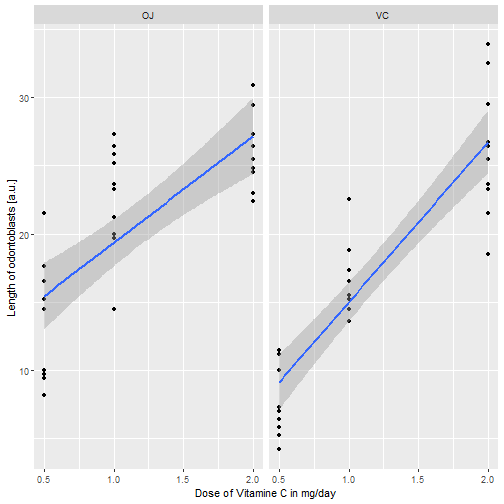
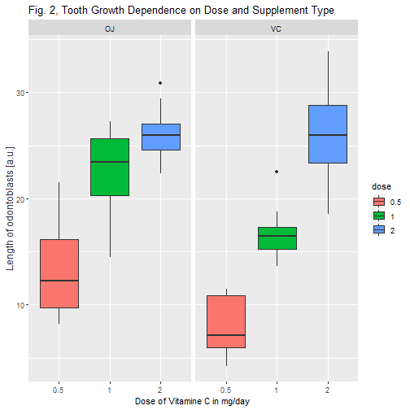

---
output:
  pdf_document: default
  html_document: default
---
# Statistical Inference Course Project - PART 2: Basic Inferential Data Analysis

RB,   
16.01.2021


```r
library(datasets)
library(data.table)
library(dplyr)
library(tidyr)
library(ggplot2)
library(lattice)
library(MASS)
```


## Load  data set


```r
data(ToothGrowth)
```

## Description

In this analysis inferential statistics is used to investigate the effect of the 
dose levels of vitamin C (0.5, 1, and 2 mg/day) on the length of odontoblasts (cells responsible for tooth growth) in 60 guinea pigs. 
To each animal the dosis was supplied by two different delivery methods (orange juice or ascorbic acid).


```r
str(ToothGrowth)
```

```
## 'data.frame':	60 obs. of  3 variables:
##  $ len : num  4.2 11.5 7.3 5.8 6.4 10 11.2 11.2 5.2 7 ...
##  $ supp: Factor w/ 2 levels "OJ","VC": 2 2 2 2 2 2 2 2 2 2 ...
##  $ dose: num  0.5 0.5 0.5 0.5 0.5 0.5 0.5 0.5 0.5 0.5 ...
```

Apparenttly, the data set contains 60 observations (rows) on 3 variables (columns).
From the documentation we see that "len" describes the length of the odontoblasts, "supp" gives information about the supplement type (ascorbic acid coded as "VC" or orange juice coded as "OJ") and the "dose" those is given in mg/day 
The first column describes the length of odontoblasts, the second column describes the 
supply method and the third column gives information about the dose level.


## Explorative Data Analysis

To get a first grasp on the data lets plot it first!


```r
qplot(x = dose, y = len, data = ToothGrowth, 
      title = "Fig. 1, Tooth Growth Dependence on Dose and Supplement Type", 
      geom=c("point", "smooth"), method="lm", facets=.~supp, 
      xlab="Dose of Vitamine C in mg/day", ylab="Length of odontoblasts [a.u.]")
```

```
## Warning: Ignoring unknown parameters: title, method
```

```
## Warning: Ignoring unknown parameters: title
```

```
## `geom_smooth()` using formula 'y ~ x'
```



**Fitting Linear Model to data to explore the dependency between length of otontoblasts and dose level**

```r
ToothGrowth_VC <- filter(ToothGrowth, supp=="VC")
ToothGrowth_OJ <- filter(ToothGrowth, supp=="OJ")
res_VC <- lm(len ~ dose, data = ToothGrowth_VC)
res_OJ <- lm(len ~ dose, data = ToothGrowth_OJ)
summary(res_VC)
```

```
## 
## Call:
## lm(formula = len ~ dose, data = ToothGrowth_VC)
## 
## Residuals:
##     Min      1Q  Median      3Q     Max 
## -8.2264 -2.6029  0.0814  2.2288  7.4893 
## 
## Coefficients:
##             Estimate Std. Error t value Pr(>|t|)    
## (Intercept)    3.295      1.427   2.309   0.0285 *  
## dose          11.716      1.079  10.860 1.51e-11 ***
## ---
## Signif. codes:  0 '***' 0.001 '**' 0.01 '*' 0.05 '.' 0.1 ' ' 1
## 
## Residual standard error: 3.685 on 28 degrees of freedom
## Multiple R-squared:  0.8082,	Adjusted R-squared:  0.8013 
## F-statistic: 117.9 on 1 and 28 DF,  p-value: 1.509e-11
```

```r
summary(res_OJ)
```

```
## 
## Call:
## lm(formula = len ~ dose, data = ToothGrowth_OJ)
## 
## Residuals:
##     Min      1Q  Median      3Q     Max 
## -7.2557 -3.7979 -0.0643  3.3521  7.9386 
## 
## Coefficients:
##             Estimate Std. Error t value Pr(>|t|)    
## (Intercept)   11.550      1.722   6.708 2.79e-07 ***
## dose           7.811      1.302   6.001 1.82e-06 ***
## ---
## Signif. codes:  0 '***' 0.001 '**' 0.01 '*' 0.05 '.' 0.1 ' ' 1
## 
## Residual standard error: 4.446 on 28 degrees of freedom
## Multiple R-squared:  0.5626,	Adjusted R-squared:  0.547 
## F-statistic: 36.01 on 1 and 28 DF,  p-value: 1.825e-06
```


```r
ToothGrowth$dose=as.factor(ToothGrowth$dose)
ggplot(ToothGrowth, aes(x=dose,y=len))+geom_boxplot(aes(fill = dose)) +
      ggtitle("Fig. 2, Tooth Growth Dependence on Dose and Supplement Type") +
      facet_grid(.~supp) + 
      theme(axis.title.y =  element_text(colour="gray20",size=12,angle=90,hjust=.5,vjust=1)) +
      labs(x = "Dose of Vitamine C in mg/day", y = "Length of odontoblasts [a.u.]")
```




We observe that the length of otontoblasts (tooth growth) show a positve linear correlation with the dose level yielding slopes of 11,7 (VC) and 7,8 (OJ) (Fig. 1).  The tooth growth increases (median) with the amount of dose for all dose levels (Fig. 2). In order to verify this first impression lets do statistical testing. 


## Hypothesis Testing

**1. Does the supply method (VC: ascorbic acid or OJ: orange juice) has an effect on tooth growth?**

First test if the variances of this two samples are equal by using the F-test assuming that they are normally distributed?
 

```r
var.test(len ~ supp, data = ToothGrowth)
```

```
## 
## 	F test to compare two variances
## 
## data:  len by supp
## F = 0.6386, num df = 29, denom df = 29, p-value = 0.2331
## alternative hypothesis: true ratio of variances is not equal to 1
## 95 percent confidence interval:
##  0.3039488 1.3416857
## sample estimates:
## ratio of variances 
##          0.6385951
```

**Result**: A p-value of p = 0.23 was obtainted, which is greather than the significance level of 0.05. To conclude, the two variances do not significantly differ from each other.  

Based on the variance test use a two-sample t-test with the following null hypothesis: 

**H0: Supply method does not affect the tooth growth**


```r
t.test(len~supp, data=ToothGrowth, conf.level = 0.95, 
       alternative="two.sided", var.equal = TRUE, paired = FALSE)
```

```
## 
## 	Two Sample t-test
## 
## data:  len by supp
## t = 1.9153, df = 58, p-value = 0.06039
## alternative hypothesis: true difference in means is not equal to 0
## 95 percent confidence interval:
##  -0.1670064  7.5670064
## sample estimates:
## mean in group OJ mean in group VC 
##         20.66333         16.96333
```

**Result & Conclusion**:
A p-value of 0.06 was obtained and the confidence interval of the test contains zero.
We conclude that we can’t reject the null hypothesis. 
This means that there is *no significant difference* between the supply methods ascorbic acid and orange juice.

**2. Does the dosis level has an effect on tooth growth?**

Based on our explorative data analysis (ref. Fig. 2) we will compare the two samples with dose level 1-2 mg and 0.5-2 mg per day for the supply method orange juice, since those apparently show the smallest and largest difference in tooth length.  To test our hypothesis we use a two-sided-unpaired Welch t-test assuming unequal variance with significance level 0.05. 

**H0: Dose level does not affect the tooth growth**


```r
t.test(ToothGrowth_OJ$len[ToothGrowth_OJ$dose == 1], 
       ToothGrowth_OJ$len[ToothGrowth_OJ$dose == 2], paired = FALSE, var.equal = FALSE)
```

```
## 
## 	Welch Two Sample t-test
## 
## data:  ToothGrowth_OJ$len[ToothGrowth_OJ$dose == 1] and ToothGrowth_OJ$len[ToothGrowth_OJ$dose == 2]
## t = -2.2478, df = 15.842, p-value = 0.0392
## alternative hypothesis: true difference in means is not equal to 0
## 95 percent confidence interval:
##  -6.5314425 -0.1885575
## sample estimates:
## mean of x mean of y 
##     22.70     26.06
```


```r
t.test(ToothGrowth_OJ$len[ToothGrowth_OJ$dose == 0.5], 
       ToothGrowth_OJ$len[ToothGrowth_OJ$dose == 2], paired = FALSE, var.equal = FALSE)
```

```
## 
## 	Welch Two Sample t-test
## 
## data:  ToothGrowth_OJ$len[ToothGrowth_OJ$dose == 0.5] and ToothGrowth_OJ$len[ToothGrowth_OJ$dose == 2]
## t = -7.817, df = 14.668, p-value = 1.324e-06
## alternative hypothesis: true difference in means is not equal to 0
## 95 percent confidence interval:
##  -16.335241  -9.324759
## sample estimates:
## mean of x mean of y 
##     13.23     26.06
```

**Result & Conclusion**: 
P-values of 0.04 / 1.3E-6 were obtained and the confidence intervals do not not contain zero.
So we conclude to reject in both cases the null hypothesis. 
So we state that the dose level has an *statistically significant effect* on the length of the odontoblasts (tooth growth).
